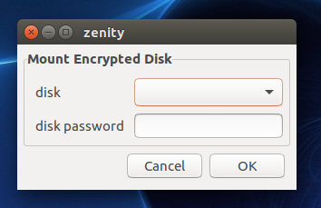
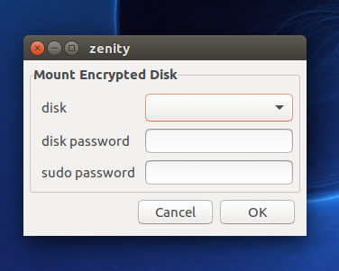
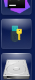

# Welcome to med.sh
Mount Encrypted Disk is a utility script to mount disks that are encrypted with BitLocker on Ubuntu. Using `dislocker` and `zenity` packages, MED provides UI that facilitates process of mounting. It also adds icon to Ubuntu launcher for easy access.

## Features
1. Automates the process of mounting disks with `dislocker`
2. Provides UI similar to Windows. 

 

3. Works both with sudo and without it (asks for sudo password.)

 

4. Adds Launcher icon.



## Getting Started

### 1. Clone this repository on Ubuntu.
Recommended directory is `/opts/` but any directory should work fine.
```
git clone https://github.com/bwmhamad/med.sh.git
```
### 2. Install [dislocker](https://tuxdiary.com/2015/03/20/dislocker/)
```
sudo apt-get install libmbedcrypto0 libmbedtls-dev libfuse-dev
```
If git is not installed on your system you can install git by running the following command. Open the terminal and type:
```
sudo apt install git
```
Then you can install `dislocker` from source using git. Open the terminal and type the below commands.
```
git clone https://github.com/Aorimn/dislocker.git
cd dislocker
cmake .
make
sudo make install
```
### 3. Install missing dependencies **(should be already installed though)**
 ```
sudo apt install zenity
sudo apt install lsblk
```
### 4. Add symbolic link **(optional)**
```
sudo ln -s /opt/med.sh/med.sh /usr/bin/med
```

### 5. Add launcher icon **(optional)**
```
med -l install
```

## Dependencies
1. [dislocker](https://github.com/Aorimn/dislocker) 
2. [zenity](https://github.com/GNOME/zenity)

## Compatibility
Currently only tested on Ubuntu 16.04 but should work fine on any Ubuntu or maybe even any distribution with GNOME.

## @TODO
- [ ] Add script that handles messages to allow CLI only usage.
- [ ] Display only disks that are encrypted with BitLocker.
- [ ] Better handle for arguments.
- [ ] Test and adapt on other distributions.
- [ ] Create C/C++ project or package (if you guys like this script :) ).

## Notice 
This software is provided as is without any warranty of any kind. Project was created for personal needs. Your contribution is valuable to us, feel free to add any changes and fixes for the script. 
